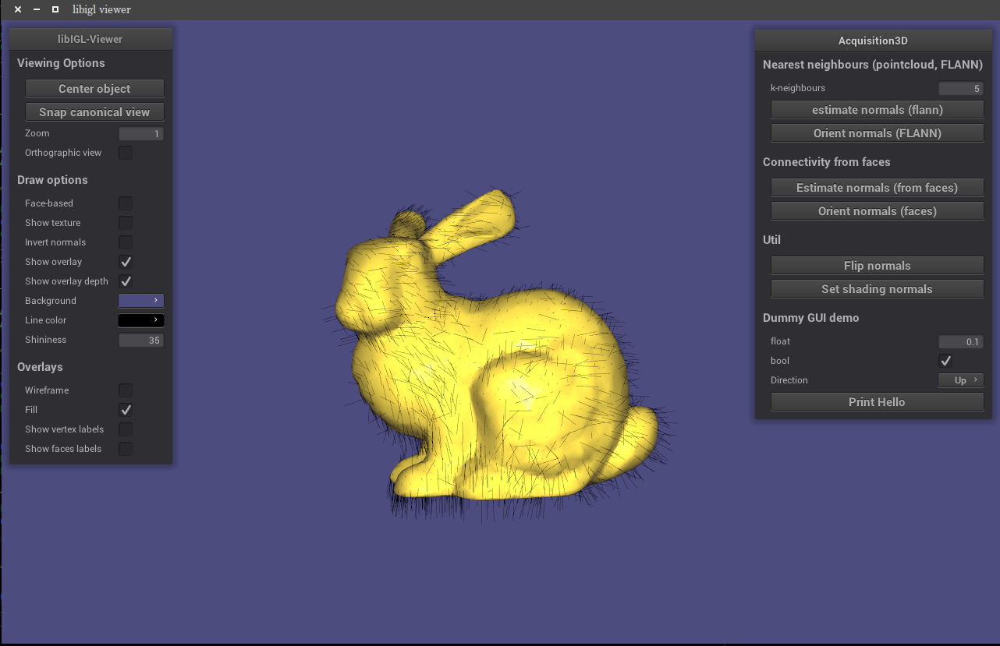

# Example code for compM080/GV18 (UCL)
COMPM080/GV18: Acquisition and Processing of 3D Geometry exapmle code for visualization. 


# Dependencies:
* Git ([Git](https://git-scm.com/downloads))
* CMake ([CMake](https://cmake.org/download/))
* OpenGL 3.3 or newer
* [libIGL](http://libigl.github.io/libigl/) (auto-installed using setup.sh/bat)
* [NanoGui](https://github.com/libigl/nanogui) (auto-installed using setup.sh/bat)


## OSX
You'll need to install GLEW using
* [Homebrew](http://brew.sh/) `brew install glew` &nbsp; &nbsp; &nbsp;or
* [MacPorts](https://www.macports.org/) `sudo port install glew +universal`.

## Unix
* Ubuntu: `sudo apt-get install cmake git xorg-dev libglew-dev libgl1-mesa-dev`

---

# Install:

## Windows
* Run [Visual Studio](https://www.visualstudio.com/vs/community/) command prompt:
"VS2015 x64 Native Tools Command Prompt" <br />
`C:\Program Files (x86)\Microsoft Visual Studio 14.0\Common7\Tools\VsDevCmd.bat`

```
git clone http://github.com/smartgeometry-ucl/compM080-compGV18
cd IGLFramework
./setup.bat
```

## OSX/Unix 
* Open a "terminal"

```
git clone http://github.com/smartgeometry-ucl/compM080-compGV18
cd IGLFramework
./setup.sh
```

---
# Example

